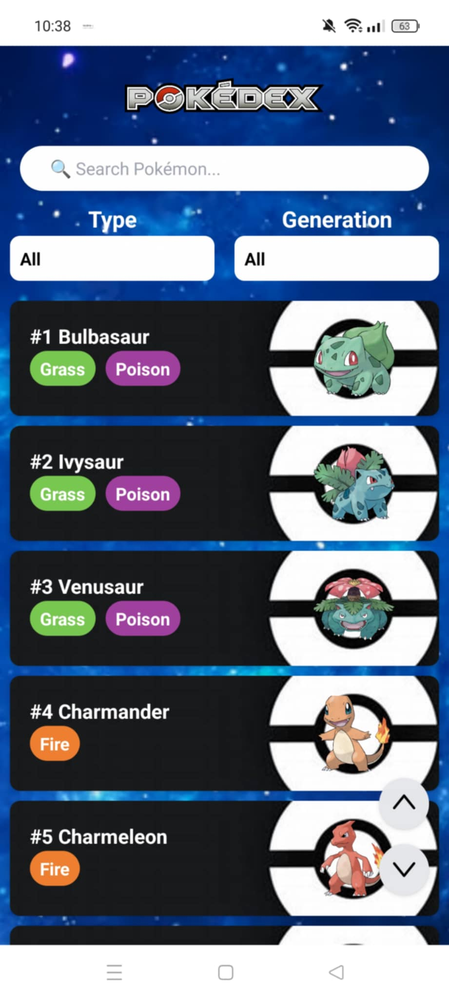
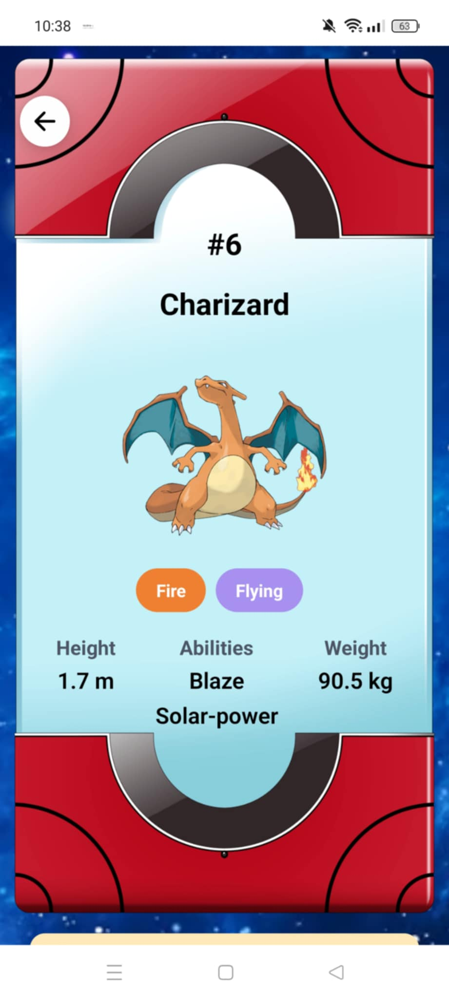
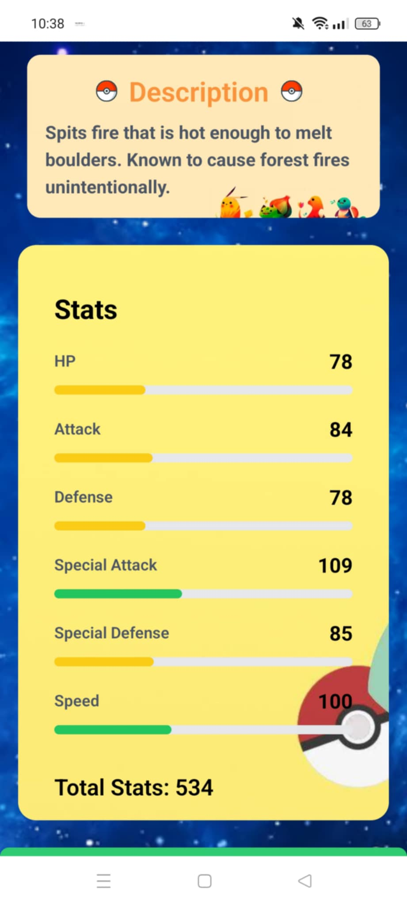
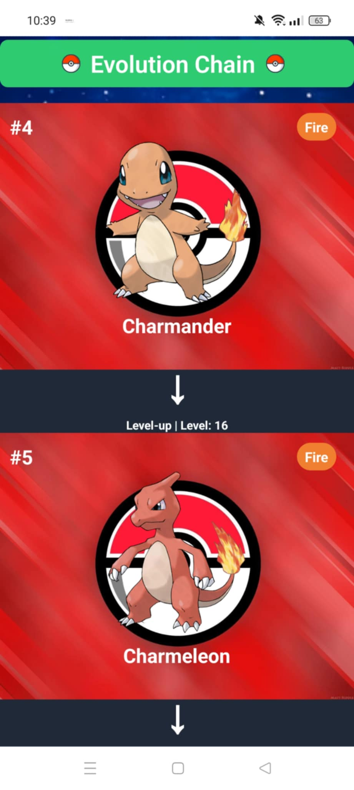

# Pokémon Dictionary
<p align="center">
  
  
  
</p>
<p align="center">
  
  
  
</p>

**Pokémon Dictionary** là một ứng dụng di động giúp người dùng tìm kiếm và xem thông tin chi tiết về các Pokémon, bao gồm tên, loại, hình ảnh và nhiều thông tin thú vị khác.

## Giới Thiệu
Ứng dụng được xây dựng bằng **React Native** và **Expo**, sử dụng API từ **PokeAPI** để lấy dữ liệu về các Pokémon. Bạn có thể dễ dàng duyệt qua danh sách các Pokémon, tìm kiếm thông tin chi tiết về từng Pokémon, bao gồm ID, tên, loại và hình ảnh.

## Các tính năng
- Hiển thị danh sách tất cả các Pokémon.
- Cung cấp thông tin chi tiết về từng Pokémon, bao gồm: ID, tên, loại và hình ảnh.
- Tải dữ liệu tự động và hiển thị thông báo khi dữ liệu đang được tải.
- Giao diện người dùng thân thiện và dễ sử dụng.

## Công Nghệ Sử Dụng
- **React Native**: Một framework mã nguồn mở cho phép phát triển ứng dụng di động sử dụng JavaScript và React. Giúp tạo ứng dụng cho cả Android và iOS từ một codebase chung.
- **Expo**: Expo là một công cụ phát triển giúp đơn giản hóa quá trình phát triển ứng dụng React Native mà không cần cấu hình phức tạp như Android Studio hay Xcode.
- **twrnc**: Thư viện tích hợp Tailwind CSS cho React Native, giúp sử dụng các lớp Tailwind trực tiếp trong các component React Native, làm cho mã nguồn gọn gàng và dễ quản lý hơn.

## Yêu Cầu Hệ Thống
Trước khi bắt đầu, bạn cần cài đặt phiên bản **NodeJS >= 22** (hoặc phiên bản tương thích) trên hệ thống của mình.

## Cài đặt
1. Cài đặt các phụ thuộc
Để cài đặt các phụ thuộc cho dự án, bạn cần chạy lệnh sau:

```bash
npm install
```
2. Chạy ứng dụng
Để chạy ứng dụng trên thiết bị hoặc trình giả lập, bạn sử dụng lệnh:

```bash
npx expo start
```
Sau khi lệnh trên chạy, bạn có thể mở ứng dụng trong Expo Go trên thiết bị của mình, hoặc mở trên giả lập Android hoặc iOS.

3. Kiểm tra ứng dụng
Ứng dụng sẽ tự động tải danh sách Pokémon từ API và hiển thị chúng trong một danh sách. Mỗi Pokémon được hiển thị trong một thẻ với các thông tin chi tiết như ID, tên và loại.

## Tài nguyên
- Tài liệu Expo: https://docs.expo.dev/ - Học cách phát triển ứng dụng với Expo.

- PokeAPI: https://pokeapi.co/ - API để lấy dữ liệu về các Pokémon.

## Ghi chú
- Ứng dụng đang sử dụng API miễn phí từ Railway.app, vì vậy có thể gặp tình trạng tạm ngưng dịch vụ nếu hết hạn.
- Để trải nghiệm ứng dụng mượt mà, khuyến nghị sử dụng Expo Go trên thiết bị di động thực tế.

## Liên kết hệ thống
- **Back-End (GitHub)**: https://github.com/LongMyNgoc/Pokemon-Dictionary-BE.git
- **Back-End (Railway)**: https://pokemon-dictionary-be-production.up.railway.app/
- **Front-End (GitHub)**: https://github.com/LongMyNgoc/Pokemon-Dictionary-App.git

## Demo
- Video Youtube: https://youtu.be/uoEZRN--LCs
- File APK: https://expo.dev/accounts/longmyngoc/projects/Pokedex/builds/6c5899ff-281e-4fe3-825f-44dbca899feb

## Đóng góp & Phát triển
Chúng tôi luôn chào đón sự đóng góp từ cộng đồng! Nếu bạn có bất kỳ ý tưởng, cải tiến hoặc báo lỗi nào, vui lòng gửi qua hệ thống quản lý mã nguồn của dự án. Bạn cũng có thể liên hệ trực tiếp với nhóm phát triển để thảo luận thêm.

## Thông tin liên hệ
📧 Email: nguyenphilong.dev@gmail.com 
🌐 Portfolio: https://nguyenphilongportfolio.vercel.app/